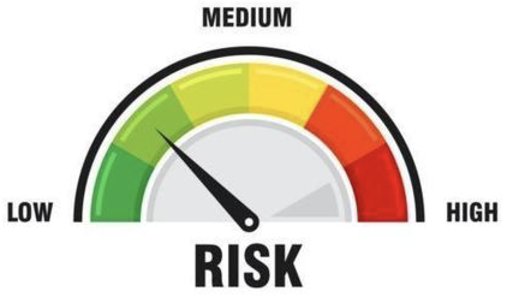
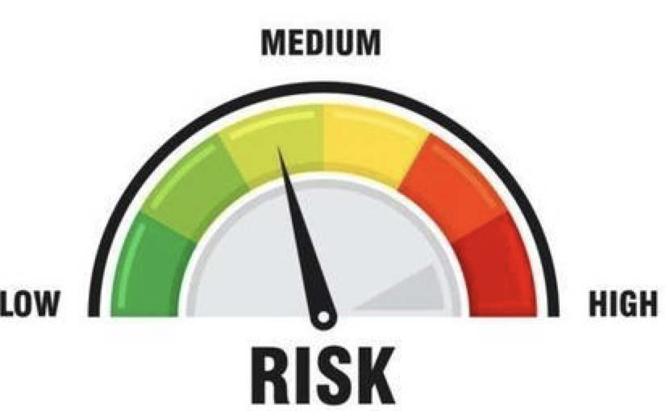
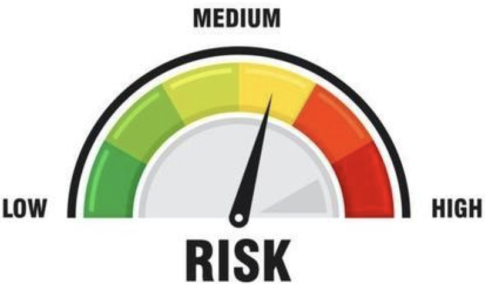
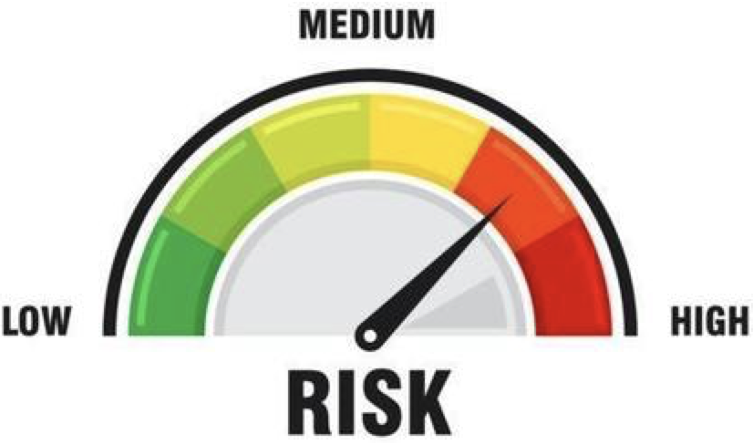
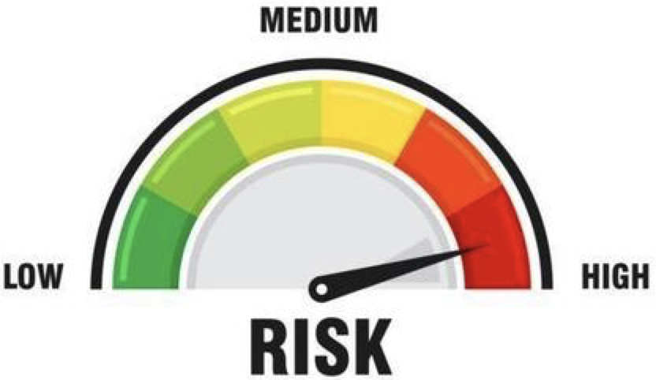

# Description

Please include a summary of the change and which issue is fixed. Please also include relevant motivation and context. List any dependencies that are required for this change.

Fixes # (issue)

## Type of change

Please delete options that are not relevant.

- [ ] Bug fix (non-breaking change which fixes an issue)
- [ ] New feature (non-breaking change which adds functionality)
- [ ] Breaking change (fix or feature that would cause existing functionality to not work as expected)
- [ ] This change requires a documentation update

# Risk Assessment
Please, select the proper checkbox and keep the respective chart bellow, please, remove this description and the rest of the 
 
 
 
 

- [ ]  **Extreme Risk**:
  - Airflow DAGs or Core Framework logic
    - Validation Framework
    - Schema files parsing
    - Connector
  - Multiple pipelines impactable(**Ie. More than 5 pipelines impacted**) 
  - Hard to test code changes, **not able to test all code changes before deployment** 
- [ ]  **Severe Risk**:
  - Airflow DAGs or Core Framework logic
    - Validation Framework
    - Schema files parsing
    - Connector
  - Multiple pipelines impactable(**Ie. Between 3 and 5 pipelines impacted**) 
  - Hard to test code changes, **not able to test all code changes before deployment** 
- [ ]  **Elevated Risk**:
  - Airflow DAGs
  - Simple logic **NOT** associated to the `core framework`
  - Limited number of pipelines impactable(**Ie. up to 3 pipelines impacted**) 
  - Easily testable code, **all new code impacted flows tested** 
- [ ]  **Moderate Risk**:
  - Simple logic **NOT** associated to the `core framework`
  - Single pipelines impactable  
  - Code not direct related to production operation like: Integration or unit tests
  - Easily testable code, **all new code impacted flows tested** 
- [ ]  **Mild Risk**:
  - No code logic changed
  - Documentation changes

# How Has This Been Tested?

Please describe the tests that you ran to verify your changes. Provide instructions so we can reproduce. Please also list any relevant details for your test configuration

- [ ] Test A
- [ ] Test B

## Test Evidences
- [ ] Confluence page: [Link](https://)
- [ ] Screenshots:

**Test Configuration**:
* Python version: 3.7
* Docker version: Version 3.1.0(51484)
* OS version: macOS Catalina version 10.15.7
* Terraform version: v0.14.6

# [Checklist](https://smiledirectclub.atlassian.net/l/c/9CTUbb5r) (please delete the options that do not apply):
- [ ] I have commented my code, particularly in hard-to-understand areas
- [ ] My code follows the style guidelines of this project
- [ ] My changes generate no new warnings
- [ ] My code will integrate perfectly with the latest version of the framework without generating conflicts
- [ ] I have added tests that prove my fix is effective or that my feature works
- [ ] All new and existing tests passed
- [ ] I require waffle flags or switches to be set, which are listed below
- [ ] My change requires running a script (adhoc migration, etc. described below)
- [ ] This PR introduces a new celery task
- [ ] This functionality/change has been reviewed with an architect
- [ ] This PR propagates technical debt

